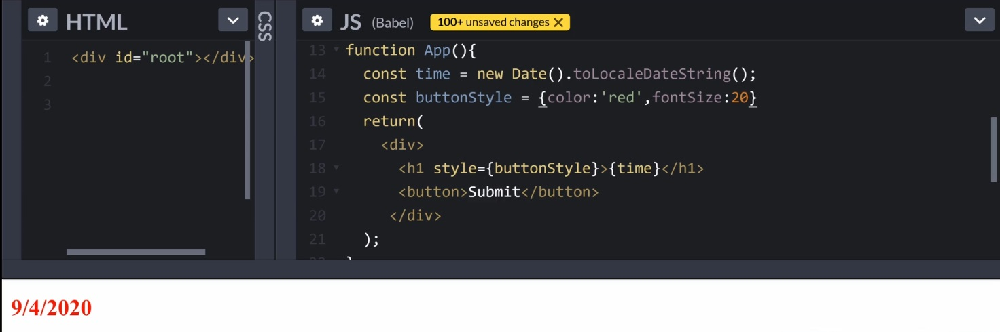

# REACT

## I. BONNES PRATIQUES

### **<u>const et let:</u>**

Pour plus de simplicité l'utilisation de const et let pour déterminer des variables sera privilégié à var pour éviter tout conflits.

Mis à part les fonctions, "var" a une portée globale ce qui rend le risque d'écrasement accidentel d'une donnée beaucoup plus important qu'avec const et let qui ont des portée limités aux accolades {} qui les contiennent.

De plus l'usage de const permet de "sécuriser" certaines données du fait de son caractère non modifiable. C'est à dire qu'à moins d'utiliser "une méthode" (ex: .push) sur une constante, on ne peux pas modifier sa valeur.

### **<u>notion d'héritage</u>**

Faire attention lorsqu'on manipule des tableaux et des objets en Javascript, la notion d'héritage est très importante car on peut modifier/effacer tout ou partie d'une tableau/objet définitivement si l'on ne prend pas garde.

Si l'on souhaite interagir sur un tableau ou un objet sans modifier l'original il faut penser à ne pas y faire référence directement

    exemple:
    const initialUsers = ["pierre", "paul", "jacques"];
    const currentUsers = initialUsers;

    currentUsers.push("Eric", "Jean");
    console.log(currentUsers);
    console.log(initialUsers);

    Résultat des console.log:
    ["pierre", "paul", "jacques", "Eric", "Jean"]
    ["pierre", "paul", "jacques", "Eric", "Jean"]

Mais y faire référence par étalement des données d'une variable en utilisant [...]

    exemple:
    const initialUsers = ["pierre", "paul", "jacques"];
    const currentUsers = [...initialUsers];

    currentUsers.push("Eric", "Jean");
    console.log(currentUsers);
    console.log(initialUsers);

    Résultat des console.log:
    ["pierre", "paul", "jacques", "Eric", "Jean"]
    ["pierre", "paul", "jacques"]

De sorte à ne pas modifier la valeur du tableau/objet d'origine et ainsi éviter de créer des erreurs/bugs.

### **<u>concaténation</u>**
Encore une fois pour plus de facilité lorsque nous allons vouloir concaténer du texte avec des variables
    
    exemple:
    let name = "paul";

    console.log("hey " + name + ", how are you?");

nous utiliserons la notation `` cad Alt Gr + 7

    exemple:
    let name = "paul";

    console.log(`hey ${name}, how are you?`);

### **<u>arrow functions</u>**
la version javascript classique(oldschool) pour écrire une fonction est la suivante:

    function sayHello(){
        console.log("hello");
    }

nous privilégierons l'utilisation de la version ES6 Javascript pour l'écriture des fonctions qui consiste en l'utilisation de constantes auxquelles nous attribuerons nos fonctions.

    exemple:
    const sayHello = () => {
        console.log("hello");
    }

Cas particulier: Si notre fonction à pour but de renvoyer(return) une information et qu'elle ne comprend qu'une seule ligne de code...

    example:
    const sayHello = (name) => {
        return `hello ${name}`;
    }

    const greetings = sayHello("paul");
    console.log(greetings);

on peut alors simplifier l'écriture de la fonction en retirant le "return" ainsi que les accolades...

    example:
    const sayHello = (name) => `hello ${name}`;
    
    const greetings = sayHello("paul");
    console.log(greetings);

cela aura exactement le même résultat, car de manière implicite si une seule ligne de code est présente dans une fonction de renvoi de données cela implique par défaut que son résultat soit renvoyé(return), il n'est donc pas nécessaire d'écrire la version longue de la fonction.

### **<u>Deconstruct</u>**
Le "Désassemblage" de données est un moyen efficace de simplifier son code lorsque l'on cherche à récupérer les informations contenues dans une tableau/objet.

Soit un objet contenant les informations d'un utilisateur:

    exemple version normale:
    const user = {
        name: "Emmanuel",
        lastName: "Dev",
        age: 44,
    };

si l'on souhaite afficher l'une des données contenues dans l'objet en console:

    console.log(user.name);
    console.log(user.lastName);
    console.log(user.age);

Maintenant passons à la version Deconstructed (Désassemblée):

    exemple version deconstruct:
    const user = {
        name: "Emmanuel",
        lastName: "Dev",
        age: 44,
    };

    const {name, lastName, age} = user;

Le principe > on crée une nouvelle constante en lui attribuant entre accolade les "keys" de l'objet/tableau qui nous intéresse avant d'indiquer le nom de la constante qui sera en fait une référence sur l'objet/tableau où aller chercher les infos!

si l'on souhaite afficher l'une des données contenues dans l'objet en console:

    console.log(name);
    console.log(lastName);
    console.log(age);

Prenons maintenant l'exemple d'un tableau:

    const numbers = [1, 2, 3, 4, 5];

    const [one, two, three, four, five] = numbers;
    ou
    const [toto, tata, tutu, titi, tete] = numbers;

    console.log(one);
    console.log(toto);

on peut donner n'importe quel nom au keys contenu entre crochets car la constante fait référence au contenu du tableau qui lui ne change pas et est ordonné comme indiqué lors de sa création.

### **<u>Méthodes Map et Filter</u>**
Prenons un tableau d'objets:
    
    const users = [
        { name: "Emmanuel", age: 44},
        { name: "Thomas", age: 16},
        { name: "Audrey", age: 28},
    ]

    const modifiedUser = users.map((user) => user);
    const filterUser = users.filter((user) => user.age === 28);
    console.log(modifiedUser);
    console.log(filterUser);

la constante _modifiedUser_ contenant la méthode _map_ nous permet de lire le contenu de la constante users objet après objet, c'est une boucle sur le contenu du tableau.

    const modifiedUser = boucle sur le tableau cité en référence((pour chaque objet du tableau) => renvoi l'objet);
    console.log(affiche en console le contenu de modifiedUser à chaque boucle)

la constante _filterUser_ contenant la méthode _filter_ nous permet de lire le contenu de la constante users objet après objet, c'est une boucle sur le contenu du tableau qui permet d'identifier et de renvoyer du contenu correspondant à une condition qu'on lui applique.

    const filterUser = boucle sur le tableau cité en référence((pour chaque objet du tableau) => renvoi uniquement l'objet dont l'age est égal et strictement égal à 28);
    console.log(affiche en console le contenu de modifiedUser à chaque boucle)

## II. LES BASES

### **<u>Pourquoi apprendre React??</u>**
React est un framework, un ensemble de librairies JavaScript, qui permet de créer des applications web, ou autres, de manière centralisé en langage javascript sans avoir à utiliser des fichiers HTML/CSS.
Tout est centralisé dans un seul fichier Javascript qui va s'occuper de générer l'ensemble du code (HTML/CSS) en utilisant la syntaxe JSX spécifique à React.

De plus, React permet de structurer/découper son code avec ce que l'on appel des "components" ou "modules".

Pour schématiser, un fichier javascript pourra faire référence à une multitude d'autres fichiers javascript afin de construire selon nos envies et besoin des projets web. 

Un fichier js pourra construire la partie "Head" de notre projet web, un autre la partie "Body" qui elle même contiendra des appels vers d'autres fichiers js pour le "Header", "Main", "Footer" et ainsi de suite en cascade.

On peut donc construire toutes les parties d'un site web par example en petits _components_ interchangeables à souhait.

    Avantages de React:
    Plus permformant, moins d'échanges entres fichiers différents (HTML/CSS) puisque tout est généré en JSX depuis un fichier JS global unique.

    Un control plus structuré de nos code grace à la création de components que l'on peut insérer/retirer à souhait.

    Une organisation du code simplifiée et un structure commune à ceux qui travaillerons ensemble sur le projet.

### **<u>Fonctionnement de React? Ca ressemble à quoi?</u>**
Dans un premier temps nous allons d'abord regarder à quoi ressemble du code Javascript "vanille":

Comme on peut le voir, cela consiste en un échange entre 3 fichiers distinct, un fichier HTML pour la structure, un fichier CSS pour le styling et enfin un fichier JS pour l'interactivité.

Maintenant prenons l'exemple de ce même code simple mais générer avec React. Mais avant cela il nous faut récupérer quelques librairies à ajouter au projet.

Pour cela, il nous suffit d'aller chercher celles ci sur https://cdnjs.com/libraries que l'on insère ensuite dans notre code html avec la balise < script > < /script> comme pour font-awesome par exemple.

Nous allons d'abord ajouter React:

    

C'est le module global permettant de faire fonctionner React.

Ainsi que React-dom qui est le module utiliser pour afficher dans notre navigateur le code que l'on va produire avec React:

    

Une fois que cela est fait, nous sommes alors prêt à écrire notre code dans un fichier Javascript.
Pour reprendre notre exemple du départ avec un titre et un bouton, voici comment se présente le code en utilisant React:

    React.createElement(a,b,c);

a: correspond à l'élément HTML que l'on souhaite créer. (h1 / button / div / etc...)

b: correspond aux paramètres de l'élément que l'on souhaite créer (id, className, style, etc...)

c: correspond au contenu textuel de l'élément que l'on souhaite créer.

Notre exemple ressemblera à:

    React.createElement("h1", null, "hello React");

Ce code va nous permettre de _générer_ l'élément h1 et son contenu, mais pour pouvoir le visualiser dans le navigateur il faut indiquer que c'est le module **react-dom** qui va s'en occuper.

    ReactDOM.render(a,b);

a: correspond à ce que l'on veux générer dans le browser, que cela soit 1 élément ou un ensemble d'éléments réunis dans une fonction.

b: correspond la localisation au sein de notre code contenu dans le fichier _index.html_ ou l'on va insérer le code généré par a

ci dessous exemple avec 1 élément:

ci dessous exemple avec 1 fonction incluant plusieurs éléments:

A partir de là, on s'aperçois qu'on peut utiliser uniquement javascript pour créer du code HTML, mais aussi CSS, tout en utilisant toutes les fonctionnalités de Javascript comme par exemple la création de variables à insérer dans notre code:

ici là constante **time**

ici avec du style comme en css

Pas de panique, ce que l'on essai de comprendre ici est la logique de fonctionnement de React, le code, lui, ressemble à tout autre chose beaucoup plus simple.  On voit ici la mécanique qui se passe en arrière plan, ce n'est pas la façon utilisé pour écrire du code en React.

### **<u>Introduction à JSX</u>**
JSX est une extension syntaxique de JavaScript et produit des « éléments » React. 

extension syntaxique = même langage mais écrit différemment, généralement de sorte à être plus simple à lire.

Oui mais qui dit écriture différente, dit forcément besoin d'interpréter cette nouvelle façon d'écrire. Et pour cela on va faire appel à **BABEL** qui est un compileur/traducteur javascript. Il va s'occuper de récupérer notre code JSX et de le traduire en code Javascript vanilla, ce même code prise de tête que l'on a pu voir dans la partie précédente.  

Alors passons à JSX pour ré-écrire la fonction _app_ que nous avons créer en Javascript.

On peut voir que cela s'apparente à peu de choses à du code HTML, code qui nous est familier.

La différence vient dans la syntaxe utilisé pour ajouter des variables qui nécessite l'introduction d'accolades {} ainsi que certaines nom de propriétés en Css qui diffèrent comme par example _font-size_(CSS) qui s'écrit _fontSize_ en JSX.

Une autre chose qui est extrêmement pratique, c'est l'affectation de fonctions directement depuis le code JSX, c'est à dire la création de fonctions que l'on peut ensuite affecter directement à des éléments JSX.

Ici un exemple de fenêtre d'alerte quand on click sur le bouton:

il suffit d'indiquer le paramètre **onClick** dans l'élément JSX _button_ et de lui attribuer en valeur la fonction que nous avons créé, ici **alertHandler**.

Et pour finir, ce que nous venons de coder en JSX est une fonction contenant un ensemble de codes structuré qui à une finalité précise, on appel cela un **component** ou encore un module.

### **<u>C'est quoi un component??</u>**
Pour faire simple, on prend du HTML du CSS et du Javascript que l'on met dans un seul et même fichier et c'est un component, TADA!

Avec cela on peut ainsi créer des projets complexe en ajoutant petit à petit des components les uns aux autres dans un seul et même fichier Javascript.

pour schématiser, c'est comme une structure en LEGO dont chaque pièce représente un component. On peut modeler la structure à souhait et y ajouter ou retirer des pièces en fonction du résultat final que l'on souhaite lui donner.

Un component cela peut être une barre de navigation, un bloc vidéo, un espace commentaire, un section d'un site web, un bouton avec une fonctionnalité spécifique, etc...

On peut les réutiliser plusieurs fois, facile à mettre à jour, modulables.

Donc pour être pratique, il est bon d'avoir des components qui ont une fonctionnalité que l'on pourra ensuite glisser dans une projet react de sorte à construire un ensemble logique et modulable à souhait.

Créons pour nous exercer un exemple de component dont la fonction est de faire un "_Tweet_":

    function Tweet(){
        return(
            

                <h2>Tweet</h2>
                
This stuff is pretty cool!

            

        );
    }

Maintenant, en l'état actuel la fonction n'affichera rien tant qu'elle n'est pas appelée et incluse dans notre fonction app. Pour rappel, nous avons cibler dans le code l'élément div "_root_" afin qu'il affiche le contenu que va générer la fonction "_app_"

    Règle:
    ReactDOM.render(a,b);

    appliquée à notre exemple:
    ReactDOM.render(React.createElement(app), document.querySelector("#root"))

Pour que notre component soit pris en compte il nous faut donc l'insérer dans notre component principal "_app_" de la manière suivante:

    function app(){
        const time = new Date().toLocaleDateString();
        const buttonStyle = {fontSize: 20, color: "red"};
        const alertHandler = () => {
            alert("hey");
        }
        return(
            

                <h1 style={buttonStyle}>{time}</h1>
                <button onClick={alertHandler}>Submit</button>
                <Tweet/>
            

        )
    }

Cela ressemble à une balise sous la forme **< Tweet/ >** et cela peut être introduit dans n'importe quel component car celui ci est indépendant et possède sa propre structure, styles et fonctionnalité.

Peu importe ou l'on place notre component Tweet, son code fonctionnera. On peut l'utiliser à de multiple reprises, il fonctionnera toujours autant de fois qu'on le souhaite.

De plus, du fait que nous utilisons Babel en association avec JSX, nous pouvons simplifier la syntaxe de la ligne de code permettant l'affichage du code dans le navigateur de la manière suivante:

    ReactDOM.render(<app />, document.querySelector("#root"))

C'est tout ce qu'il faut principalement se rappeler de l'utilisation de React pour construire des applications et sites web.

### **<u>Mise en place d'une base pour un projet React</u>**

1- installer Visual Studio Code (https://code.visualstudio.com/download)

2- installer NodeJS (https://nodejs.org/en/download/)

3- Contrôlez que node a correctement été installé en utilisant la commande ci dessous dans votre terminal VSC. Si en réponse vous obtenez un numéro de version c'est que nodeJS est bien installé, sinon c'est qu'il ne l'est pas. Retournez à l'étape 2 en cas d'échec de l'installation.
   
    node -v

4- Créer depuis VSC un dossier pour votre projet React.
5- Aller sur https://create-react-app.dev/docs/getting-started/ et utiliser dans le terminal VSC les commandes de démarrage rapide pour installer un dossier contenant tous les modules de bases dont vous allez avoir besoin pour votre projet React (Babel, Webpackn, etc... ). En cas de problèmes se référer à la doc du site.

    npx create-react-app nom_du_projet
    cd nom_du_projet
    npm start

### **<u>Que contient ce dossier de base?</u>**
1- README.md: C'est un fichier écrit en Markdown, langage de balisage, qui à pour but de formater du texte à une fin informative. C'est dans ce fichier que l'on insère tout ce qu'il faut savoir sur le projet.

2- package.json: Est un fichier qui récapitule les informations technique du projet auxquels il est rattaché. C'est dans ce fichier que l'on retrouve la liste des dépendances, des scripts, du nom du projet, de sa version, etc...
Si l'on est en possession de ce fichier dans le cadre d'une copie d'un projet tiers, il suffit simplement de taper dans votre terminal la commande:

    npm install

pour que le contenu complet du projet soit télécharger sur votre machine dans le dossier de votre choix.

3- package-lock.json: Est un fichier qui prend un instantané du projet lors de sa création ce qui permet de conserver indéfiniment la version original du projet avec toutes ses dépendances dans leur version exact au moment de leur création pour ce projet. Cela permet ainsi que pouvoir revenir à la structure originale même des années après sa création. C'est un fichier qui nous assure que quoi qu'il arrive le projet fonctionnera.

4- .gitignore: Est un fichier qui nous permet d'indiquer à git tous les dossiers et fichiers que l'on souhaite ignorer lors du transfert de fichiers vers notre github. Tout ce qui est noté à l'intérieur de gitignore sera ignoré lors d'un push vers github. 
Généralement, on ignore les fichiers et dossiers de gros volumes tels que les dossiers "node_modules" ou "img" qui peuvent atteindre des centaines de Mo, mais aussi les fichiers config qui pourraient contenir des mots de passe ou des informations trop sensibles sur votre projet.

5- public: Ce dossier contient notre fichier index.html, c'est le dossier ou l'on pourra aussi ajouter des images/icons ainsi que le fichier "robots.txt" pour le SEO.

6- src: Ce dossier est **LE dossier** dans lequel nous allons stocker nos "_components_", nos fichiers CSS, et tout plein d'autres bonnes choses. Il contient d'ailleurs un modèle de base qui est fourni lors de l'installation du projet, pour le visualiser il suffit dans le terminal de taper la commande suivante:

    npm start

Cela va ouvrir une nouvelle page dans votre navigateur et démarrer un serveur lecture en direct qui vous permettra de travailler et modifier en live sur votre projet.

### **<u>Déclarer une classe en JSX, className vs class</u>**
Comme nous l'avons vu plus haut en introduction à JSX, il s'agit d'une extension syntaxique de JavaScript qui produit des « éléments » React.

**Cela ressemble à du HTML mais cela n'en est pas, c'est du JSX!**

C'est pourquoi il existe quelques différences comme celle de la désignation de classes. 

En HTML:

    

        <h2>Tweet</h2>
        
This stuff is pretty cool!

    

En JSX:

    

        <h2>Tweet</h2>
        
This stuff is pretty cool!

    

### **<u>Import / Export Quésaco?</u>**
Avec ce projet, Webpack est inclus dans les dépendances, ce qui veux dire que nous pouvons créer nos "components" dans des fichiers séparés.

Si l'on veux inclure un fichier/component/package dans un autre fichiers, disons notre fichiers _App_, il faut utiliser le terme **import**.

Exemple:

    import React from "react";

Cela signifie:

    importe React à partir du fichier react

De même, lorsque l'on souhaite rendre disponible une fonction/component à l'export, il faut l'indiquer en fin de code en utilisant le terme **export**. 

    function Box() {
        return(
            

                <h1>Hello box</h1>
            

        );
    }

    export default Box;

Exemple d'import de notre fonction Box dans un fichier App.js:

    import React from "react";  (ceci est un package)
    import ReactDOM from "react-dom";  (ceci est un package)
    import Box from "./Box";  (ceci est un component)

<!-- et pour afficher notre fonction dans le navigateur, il suffit de l'appeler depuis notre fichier App.js -->

    ReactDOM.render(<Box />, document.getElementByID("root"));
    
### **<u>Création d'un component avec React</u>**
Nous avons vu ce qu'était JSX, import, export, on a donc tout ce qu'il nous faut pour créer notre premier component React.

Dans un premier temps il faut indiquer que l'on va utiliser React en important le package, puis on écris notre code JSX et finalement on rend disponible notre component en lui attribuant le terme export à la fin du code.

    import React from "react";

    function testComponent(){
        return(
            

                <h2>Hello React</h2>
                <h3>From test Component</h3>
            

        );
    }

    export default testComponent;

son utilisation à l'export se fera comme vu précédemment en l'important dans le fichier souhaité:

    import React from "react";  (ceci est un package)
    import ReactDOM from "react-dom";  (ceci est un package)
    import Box from "./Box";  (ceci est un component)
    import testComponent from "./testComponent"; (ceci est un component)

    function App(){
        return(
            

                <Box />
                <testComponent />
            

        );
    }

    export default App;

### **<u>Paramétrer son VSC pour React</u>**
Cette partie n'est absolument pas obligatoire, c'est un exemple et une recommandation, rien de plus.

Comme VSC est notre outils pour coder nos projet il vaut mieux le paramétrer afin de réduire un maximum notre difficulté. Comme le répétait un de mes formateurs, le développeur est un fainéant et il n'aime pas avoir à dépenser son énergie. Donc autant être le meilleur fainéant possible et utiliser les extensions qui vont faire une bonne partie du travail à notre place!!!

Voici donc une liste d'étapes à suivre qui pourront s'avérer utiles! 

1- Installer **Material Theme**: Pour choisir un theme vous correspondant, dark, light, colored, etc...

Install: View > Command Palette > Preferences Color Theme + votre choix

2- Installer **Material Icon Theme**: Ce sont les petits icons qui apparaissent dans la barre d'exploration (la partie gauche) de votre fenêtre. il y'aura ainsi des icons pour html/css/js/nodeJs/Git/etc...

3- Paramétrer Le Langage à utiliser en cliquant en bas à droite sur le nom du langage utilisé. Cela devrait être logiquement Javascript si vous avez créé un fichier Js. Une fois cliqué, entrez "React" dans la barre de recherche qui est apparu et sélectionnez **Javascript React**

Il existe une solution pour automatiser le passage du langage Javascript à Javascript React chaque fois que vous créez un nouveau fichier Js:

Roue de paramètres(en bas à gauche) puis: Settings > clic sur petit icon en former de fichier en haut a droite (Edit settings XML).

Le fichier "Settings.json" va s'ouvrir et c'est dans ce fichier entre les les accolades qu'il va falloir copier/coller cette ligne de code:

    "files.associations": {
        "*.js": "javascriptreact"
    },

Une fois que c'est fait, il suffit alors de sauvegarder et éventuellement de redémarrer VSC.

